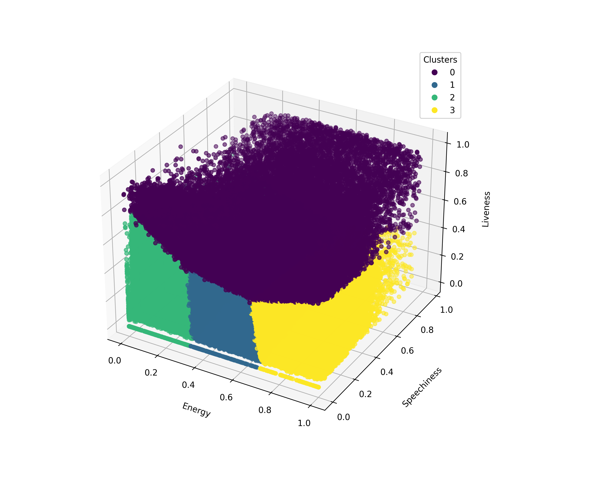

# HighPerformanceFinal

## Division of Labor
Landon: Implemented the serial and shared memory CPU implementations. Created the github repo and discord. Created all the python utils to visualize, validate, and trim the dataset. Wrote the README and organized the project structure including helpers.cpp and kmeans.cpp.

Kevin: Implemented the cuda GPU and distributed GPU implementations, updated the readme accordingly.

Brady: Implemented the distributed CPU implementation and updated the readme accordingly. Brady also performed the scaling studies.

## How To Run

Because the centroids in the kmeans algorithm are randomly initialized, each implementation is run
from a single master file that shares the starting centroids between implementations.

### Program Arguments

The program takes three arguments:
1. \<k> : The number of clusters.
2. \<epochs> : The number of epochs. 
3. \<input_file> : The path to the trimmed input CSV file containing the data.
4. \<output_dir> : The directory where the output files will be saved (no trailing slash).

Optional Flags:
- `--skip-serial` : Skip executing the serial implementation.
- `--shared-cpu` : Run the shared memory CPU implementation. This implementation will prompt for the number of threads to use, must be an integer.
- `--cuda-gpu` : Run the CUDA GPU implementation.
- `--dist-cpu` : Run the distributed computing CPU implementation.
- `--dist-gpu` : Run the distributed computing GPU implementation.

Using these flags, every implementation can be run sequentially or one at a time. Each will report the total execution time and create a unique output file appended with the implementation name e.g. `serial_output.csv`.

### Running on CHPC
Load the necessary modules

` module load gcc cuda intel-mpi cmake python`

When running in the CHPC, if running a GPU implementation ensure a GPU has been allocated, and compile with the following 
` nvcc -ccbin mpicxx -Xcompiler -fopenmp ./kmeans_implementations/*.cpp ./kmeans_implementations/*.cu -o kmeans`

If running an implementation that uses MPI this command is required for compatibility
`export I_MPI_FABRICS=shm`

The command to run all implementations sequentially on the CHPC is the following:
```bash
mpirun -n <num_nodes> ./kmeans <k> <epochs> ./csvs/trimmed_track_features.csv ./csvs --shared_cpu <num_threads> --cuda_gpu --dist_cpu --dist_gpu
```

*** NOTE *** : this method of running is not ideal and may harm the performance of each method. For scaling studies and best performance it is recommended to run one method at a time. In the following sections commands are given to run each implementation stand-alone. Compilation is the same for every method and that command can be seen above. Also, keep in mind that when running all the implementations simultaneously the <num_threads> arg for shared_cpu will be multiplied by the num_nodes argument. 

### Serial Implementation

Example execution of serial implementation: 

```bash
./kmeans 4 25 ./csvs/trimmed_track_features.csv ./csvs
```

### Shared Memory CPU Implementation

Example execution of shared memory CPU implementation:

```bash
./kmeans 4 25 ./csvs/trimmed_track_features.csv ./csvs --shared_cpu 8 --skip_serial
```

### CUDA GPU Implementation

Example execution of CUDA GPU implementation:

```bash
./kmeans 4 25 ./csvs/trimmed_track_features.csv ./csvs --cuda-gpu --skip_serial
```

### Distributed CPU Implementation

Example execution of Distributed CPU implementation:

```bash
mpirun -n 2 ./kmeans 4 25 ./csvs/trimmed_track_features.csv ./csvs --dist_cpu --skip_serial
```

## Python Utilities

It is recommended to create a python virtual environment to run the python utilities. A requirements.txt file has been included to easily install dependencies. To create a virtual environment and install dependencies, run the following commands:

```bash
python -m venv .venv
source .venv/bin/activate  # On Windows use .venv\Scripts\activate
pip install -r requirements.txt
```

### Trim Dataset
The `trim_dataset.py` script is used to trim the original dataset down to 3 attributes to be used for the kmeans implementations. By default we use energy, speechiness, and liveness. The script takes the following arguments:
1. \<input_file> : Path to the input CSV file containing the full dataset.
2. \<output_file> : Path to the output CSV file for the trimmed dataset.

Example execution of trim dataset script:

```bash
python trim_dataset.py ./csvs/track_features.csv ./csvs/trimmed_track_features.csv
```

Note: As the full dataset is too large to be included in the repo, an already trimmed version has been included. The full dataset can be found at https://www.kaggle.com/datasets/rodolfofigueroa/spotify-12m-songs

### Visualize Output
The `visualize.py` script is used to visualize the output of the kmeans implementations. It takes the following arguments:
1. \<input_file> : Path to the input CSV file containing the kmeans output.
2. \<output_file> : Path to create the output image file (including extension).

Example execution of visualize script:

```bash
python visualize.py ./csvs/output_serial.csv ./images/serial.png
```

Example output image from visualize script:


### Validation Script
The `validateResults.py` script is used to validate the results of the kmeans implementations by comparing multiple output files to each other to ensure they are consistent. It takes the following arguments:

1. \<input_file1> : Path to the first input CSV file containing the kmeans output.
2. \<input_file2> : Path to the second input CSV file containing the kmeans output.

Example execution of validate results script:

```bash
python validateResults.py ./csvs/output_serial.csv ./csvs/output_shared_cpu.csv
```
